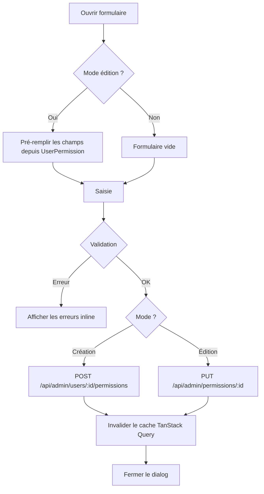

# Interface d'administration

## Vue d'ensemble

L'interface d'administration permet aux utilisateurs disposant des droits suffisants de gérer les entités structurantes de l'intranet : sociétés, agences, services, utilisateurs et les actions de permission.

Elle est accessible via le menu **Administration** dans le header, et dispose de sa propre mise en page avec une sidebar de navigation.

---

## Architecture

### Routes frontend

Toutes les routes admin sont sous le préfixe `/admin` et nécessitent une authentification **et** une société active sélectionnée.

| Route | Page | Description |
|---|---|---|
| `/admin/societes` | `SocietesPage` | CRUD des sociétés |
| `/admin/agences` | `AgencesPage` | CRUD des agences |
| `/admin/services` | `ServicesPage` | CRUD des services |
| `/admin/utilisateurs` | `UtilisateursPage` | Liste des utilisateurs |
| `/admin/utilisateurs/:userId/permissions` | `UserPermissionsPage` | Gestion des permissions d'un utilisateur |
| `/admin/actions` | `ActionsPage` | CRUD des actions de permission |

Le layout `AdminLayout` ([frontend/src/domains/admin/layout/AdminLayout.tsx](../../../frontend/src/domains/admin/layout/AdminLayout.tsx)) fournit la sidebar commune à toutes ces pages.

### Endpoints backend

| Méthode | Endpoint | Contrôleur | Description |
|---|---|---|---|
| GET/POST/PUT/DELETE | `/api/admin/companies` | `AdminCompanyController` | CRUD sociétés |
| GET/POST/PUT/DELETE | `/api/admin/agencies` | `AdminAgencyController` | CRUD agences |
| GET/POST/PUT/DELETE | `/api/admin/services` | `AdminServiceController` | CRUD services |
| GET | `/api/admin/users` | `AdminUserController` | Liste utilisateurs |
| GET | `/api/admin/modules` | `AdminUserPermissionController` | Modules + menus (pour formulaire permission) |
| GET/POST | `/api/admin/users/:id/permissions` | `AdminUserPermissionController` | Permissions d'un utilisateur |
| PUT/DELETE | `/api/admin/permissions/:id` | `AdminUserPermissionController` | Modifier / supprimer une permission |
| GET/POST/PUT/DELETE | `/api/admin/actions` | `AdminActionController` | CRUD des actions de permission |

Tous les contrôleurs sont dans `backend/src/Security/Controller/Admin/`.

---

## Gestion des sociétés

**Page :** [SocietesPage.tsx](../../../frontend/src/domains/admin/pages/SocietesPage.tsx)  
**Contrôleur :** [AdminCompanyController.php](../../../backend/src/Security/Controller/Admin/AdminCompanyController.php)  
**Entité :** `Company` (table `app_company`)

Champs gérés :

| Champ | Contrainte |
|---|---|
| `name` | Obligatoire |
| `code` | Obligatoire, unique (ex : `HFF`, `FS`) |

---

## Gestion des agences

**Page :** [AgencesPage.tsx](../../../frontend/src/domains/admin/pages/AgencesPage.tsx)  
**Contrôleur :** [AdminAgencyController.php](../../../backend/src/Security/Controller/Admin/AdminAgencyController.php)  
**Entité :** `Agency` (table `app_agency`)

Champs gérés :

| Champ | Contrainte |
|---|---|
| `name` | Obligatoire |
| `code` | Obligatoire |
| `company` | Sélection parmi les sociétés existantes |
| `services` | Checkboxes — association Many-to-Many avec `Service` |

---

## Gestion des services

**Page :** [ServicesPage.tsx](../../../frontend/src/domains/admin/pages/ServicesPage.tsx)  
**Contrôleur :** [AdminServiceController.php](../../../backend/src/Security/Controller/Admin/AdminServiceController.php)  
**Entité :** `Service` (table `app_service`)

Champs gérés :

| Champ | Contrainte |
|---|---|
| `name` | Obligatoire |
| `code` | Obligatoire |

---

## Gestion des utilisateurs et permissions

### Liste des utilisateurs

**Page :** [UtilisateursPage.tsx](../../../frontend/src/domains/admin/pages/UtilisateursPage.tsx)

Affiche la liste des utilisateurs enregistrés en base. Chaque ligne dispose d'un bouton **Permissions** qui redirige vers la page de gestion des droits de cet utilisateur.

### Page de permissions

**Page :** [UserPermissionsPage.tsx](../../../frontend/src/domains/admin/pages/UserPermissionsPage.tsx)

Les permissions sont groupées par société. Pour chaque permission, les informations affichées sont :

- Société concernée
- Ressource (module ou menu)
- Actions autorisées (badges colorés)
- Portée : toutes les agences / tous les services, ou liste restreinte

### Formulaire de permission

**Composant :** [PermissionFormDialog.tsx](../../../frontend/src/domains/admin/components/PermissionFormDialog.tsx)

Formulaire modal avec les champs suivants :

| Champ | Description |
|---|---|
| Société | Sélection parmi les sociétés disponibles |
| Type de ressource | `module` (vignette d'accueil) ou `menu` (sous-page) |
| Module | Sélection du module applicatif |
| Menu | Visible uniquement si type = `menu` |
| Actions autorisées | Checkboxes groupées par catégorie, chargées depuis `/api/admin/actions` |
| Portée — Agences | Toutes les agences, ou liste sélective |
| Portée — Services | Tous les services, ou liste sélective |



---

## Gestion des actions de permission

### Concept

Les **actions** définissent ce qu'un utilisateur peut faire sur une ressource (voir, créer, valider…). Elles sont stockées dans la table `app_action_def` et gérées dynamiquement via l'interface d'administration, contrairement à l'ancienne approche de constantes PHP statiques.

**Entité :** [AppActionDef.php](../../../backend/src/Security/Entity/AppActionDef.php)  
**Table :** `app_action_def`

```
app_action_def
├── id         → Identifiant auto-incrémenté
├── actionKey  → Clé technique unique (ex: export_pdf) — non modifiable après création
├── label      → Libellé affiché (ex: Exporter en PDF)
├── category   → Groupe d'affichage (Lecture, Écriture, Métier, Import, Administration)
└── sortOrder  → Ordre d'affichage dans les formulaires de permission
```

### Actions par défaut

Les 13 actions suivantes sont chargées via la fixture `AppActionDefFixtures` (groupe `actions`) :

| Catégorie | actionKey | Libellé |
|---|---|---|
| Lecture | `view` | Voir |
| Lecture | `export` | Exporter |
| Lecture | `print` | Imprimer |
| Écriture | `create` | Créer |
| Écriture | `edit` | Modifier |
| Écriture | `delete` | Supprimer |
| Métier | `validate` | Valider |
| Métier | `approve` | Approuver |
| Métier | `duplicate` | Dupliquer |
| Métier | `archive` | Archiver |
| Import | `import` | Importer |
| Administration | `manage_users` | Gérer utilisateurs |
| Administration | `manage_permissions` | Gérer permissions |

Pour recharger ces actions sans écraser les données existantes :

```bash
docker compose exec backend php bin/console \
  doctrine:fixtures:load --em=sqlserver --group=actions --append --no-interaction
```

### Page d'administration des actions

**Page :** [ActionsPage.tsx](../../../frontend/src/domains/admin/pages/ActionsPage.tsx)  
**Contrôleur :** [AdminActionController.php](../../../backend/src/Security/Controller/Admin/AdminActionController.php)

Les actions sont affichées groupées par catégorie avec des badges colorés. La clé technique (`actionKey`) est en lecture seule une fois créée — toute modification briserait les permissions existantes qui référencent cette clé.

---

## Composants partagés

### AdminCrudDialog

[AdminCrudDialog.tsx](../../../frontend/src/domains/admin/components/AdminCrudDialog.tsx) — Dialog réutilisable avec boutons **Annuler** / **Enregistrer** et gestion de l'état de soumission.

### AdminLayout

[AdminLayout.tsx](../../../frontend/src/domains/admin/layout/AdminLayout.tsx) — Sidebar verticale avec navigation entre les 5 sections admin. Les liens sont actifs (`NavLink`) et se colorent en bleu sur la route courante.

---

## Notes techniques

### Encodage UTF-8 (pdo_sqlsrv)

Par défaut, `pdo_sqlsrv` utilise l'encodage Windows-1252 du système. Sans configuration explicite, les caractères accentués (é, à, ç…) insérés depuis PHP en UTF-8 sont interprétés comme des bytes Latin-1 et stockés de manière corrompue dans SQL Server (ex : `é` → `é`).

**Fix appliqué** dans [SqlServerDriver.php](../../../backend/src/Doctrine/SqlServer/SqlServerDriver.php) :

```php
$options = [\PDO::ATTR_ERRMODE => \PDO::ERRMODE_EXCEPTION];
if (defined('PDO::SQLSRV_ATTR_ENCODING') && defined('PDO::SQLSRV_ENCODING_UTF8')) {
    $options[\PDO::SQLSRV_ATTR_ENCODING] = \PDO::SQLSRV_ENCODING_UTF8;
}
$pdo = new \PDO($dsn, $user, $password, $options);
```

Ce paramètre s'applique à **toutes** les tables SQL Server — pas uniquement aux actions. Si des données corrompues existent en base, elles doivent être supprimées et réinsérées après avoir appliqué ce fix.

### Fixtures et groupes

La fixture `AppActionDefFixtures` implémente `FixtureGroupInterface` avec le groupe `actions`. Cela permet de la charger de manière sélective sans toucher aux autres fixtures (sociétés, utilisateurs…) :

```bash
# Charger uniquement les actions
doctrine:fixtures:load --em=sqlserver --group=actions --append --no-interaction

# La fixture inclut une garde anti-doublon :
$existing = $repo->findOneBy(['actionKey' => $def['key']]);
if ($existing) { continue; }
```

### Client API frontend

Toutes les fonctions d'accès aux endpoints admin sont centralisées dans [adminApi.ts](../../../frontend/src/domains/admin/api/adminApi.ts). Ce fichier exporte également les types TypeScript correspondant aux réponses de l'API (`Company`, `Agency`, `Service`, `AdminUser`, `ActionDef`, `UserPermission`, `PermissionPayload`, etc.).
