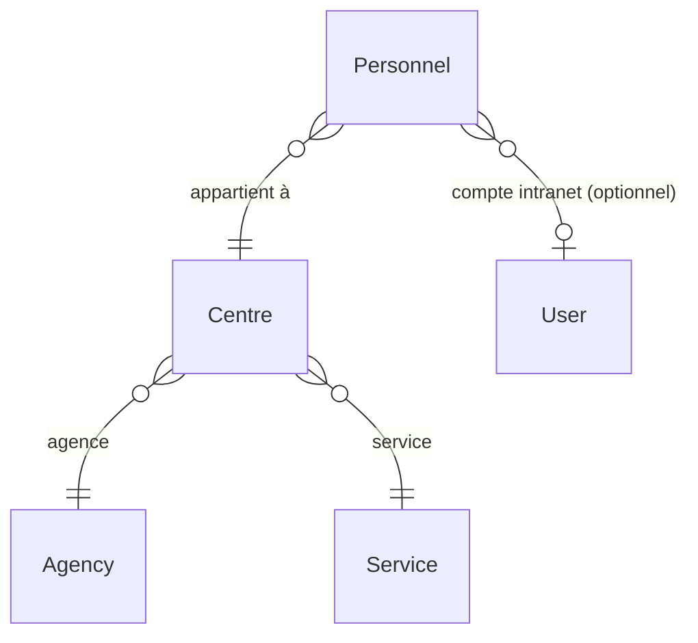
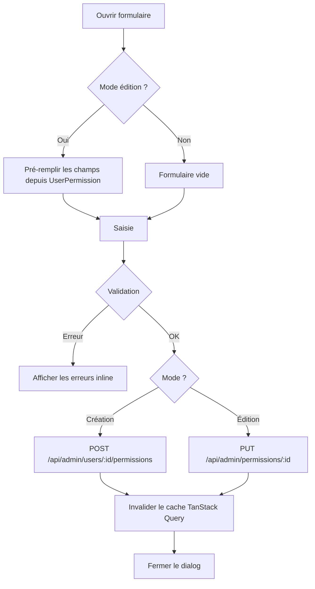
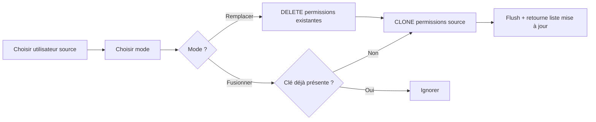

# Interface d'administration

## Vue d'ensemble

L'interface d'administration permet aux utilisateurs disposant des droits suffisants de gérer les entités structurantes de l'intranet : sociétés, agences, services, centres analytiques, personnel, utilisateurs, actions de permission et modèles de permissions.

Elle est accessible via le menu **Administration** dans le header, et dispose de sa propre mise en page avec une sidebar de navigation.

---

## Architecture

### Routes frontend

Toutes les routes admin sont sous le préfixe `/admin` et nécessitent une authentification **et** une société active sélectionnée.

| Route | Page | Description |
|---|---|---|
| `/admin/societes` | `SocietesPage` | CRUD des sociétés |
| `/admin/agences` | `AgencesPage` | CRUD des agences |
| `/admin/services` | `ServicesPage` | CRUD des services |
| `/admin/centres` | `CentresPage` | CRUD des centres analytiques |
| `/admin/personnel` | `PersonnelPage` | CRUD du personnel |
| `/admin/utilisateurs` | `UtilisateursPage` | Liste des utilisateurs |
| `/admin/utilisateurs/:userId/permissions` | `UserPermissionsPage` | Gestion des permissions d'un utilisateur |
| `/admin/actions` | `ActionsPage` | CRUD des actions de permission |
| `/admin/modeles` | `ModelePermissionsPage` | CRUD des modèles de permissions |

Le layout `AdminLayout` ([frontend/src/domains/admin/layout/AdminLayout.tsx](../../../frontend/src/domains/admin/layout/AdminLayout.tsx)) fournit la sidebar commune à toutes ces pages.

### Endpoints backend

| Méthode | Endpoint | Contrôleur | Description |
|---|---|---|---|
| GET/POST/PUT/DELETE | `/api/admin/companies` | `AdminCompanyController` | CRUD sociétés |
| GET/POST/PUT/DELETE | `/api/admin/agencies` | `AdminAgencyController` | CRUD agences |
| GET/POST/PUT/DELETE | `/api/admin/services` | `AdminServiceController` | CRUD services |
| GET/POST/PUT/DELETE | `/api/admin/centres` | `AdminCentreController` | CRUD centres analytiques |
| GET/POST/PUT/DELETE | `/api/admin/personnel` | `AdminPersonnelController` | CRUD personnel |
| GET | `/api/admin/users` | `AdminUserController` | Liste utilisateurs |
| GET | `/api/admin/modules` | `AdminUserPermissionController` | Modules + menus (pour formulaire permission) |
| GET/POST | `/api/admin/users/:id/permissions` | `AdminUserPermissionController` | Permissions d'un utilisateur |
| PUT/DELETE | `/api/admin/permissions/:id` | `AdminUserPermissionController` | Modifier / supprimer une permission |
| POST | `/api/admin/users/:id/copy-from/:sourceId` | `AdminUserPermissionController` | Copier les permissions depuis un autre utilisateur |
| POST | `/api/admin/users/:id/apply-template/:templateId` | `AdminUserPermissionController` | Appliquer un modèle de permissions |
| GET/POST/PUT/DELETE | `/api/admin/actions` | `AdminActionController` | CRUD des actions de permission |
| GET/POST/PUT/DELETE | `/api/admin/permission-templates` | `AdminPermissionTemplateController` | CRUD des modèles de permissions |

Tous les contrôleurs sont dans `backend/src/Security/Controller/Admin/`.

---

## Gestion des sociétés

**Page :** [SocietesPage.tsx](../../../frontend/src/domains/admin/pages/SocietesPage.tsx)  
**Contrôleur :** [AdminCompanyController.php](../../../backend/src/Security/Controller/Admin/AdminCompanyController.php)  
**Entité :** `Company` (table `app_company`)

Champs gérés :

| Champ | Contrainte |
|---|---|
| `name` | Obligatoire |
| `code` | Obligatoire, unique (ex : `HFF`, `FS`) |

---

## Gestion des agences

**Page :** [AgencesPage.tsx](../../../frontend/src/domains/admin/pages/AgencesPage.tsx)  
**Contrôleur :** [AdminAgencyController.php](../../../backend/src/Security/Controller/Admin/AdminAgencyController.php)  
**Entité :** `Agency` (table `app_agency`)

Champs gérés :

| Champ | Contrainte |
|---|---|
| `name` | Obligatoire |
| `code` | Obligatoire |
| `company` | Sélection parmi les sociétés existantes |
| `services` | Checkboxes — association Many-to-Many avec `Service` |

---

## Gestion des services

**Page :** [ServicesPage.tsx](../../../frontend/src/domains/admin/pages/ServicesPage.tsx)  
**Contrôleur :** [AdminServiceController.php](../../../backend/src/Security/Controller/Admin/AdminServiceController.php)  
**Entité :** `Service` (table `app_service`)

Champs gérés :

| Champ | Contrainte |
|---|---|
| `name` | Obligatoire |
| `code` | Obligatoire |

---

## Gestion des centres analytiques

**Page :** [CentresPage.tsx](../../../frontend/src/domains/admin/pages/CentresPage.tsx)  
**Contrôleur :** [AdminCentreController.php](../../../backend/src/Security/Controller/Admin/AdminCentreController.php)  
**Entité :** `Centre` (table `app_centre`)

Un centre analytique représente la combinaison d'une agence et d'un service, avec ses codes comptables (Sage).

| Champ | Type | Contrainte |
|---|---|---|
| `code` | NVARCHAR(20) | Obligatoire — ex : `01-NEG`, `80-INF` |
| `companyCode` | NVARCHAR(10) | Obligatoire — ex : `HF`, `TA` |
| `codeSage` | NVARCHAR(20) | Optionnel — ex : `AB11`, `DA14` |
| `responsable` | NVARCHAR(100) | Optionnel |
| `agency` | FK → `app_agency` | Obligatoire |
| `service` | FK → `app_service` | Obligatoire |

**Contrainte d'unicité** : `(code, codeSage)` — un même code peut exister deux fois avec des `codeSage` différents (ex : `01-NEG` avec `AB11` et `01-NEG` avec `AB21`).

### Schéma

```
app_centre
├── id           → INT IDENTITY (PK)
├── agency_id    → FK app_agency
├── service_id   → FK app_service
├── code         → ex: 01-NEG
├── company_code → ex: HF
├── code_sage    → ex: AB11  (nullable)
└── responsable  → ex: Prisca (nullable)
```

### Fixture de données

Les 62 centres sont chargés via `CentreFixtures` (groupe `centres`). La fixture est **idempotente** : elle vérifie l'existence avant d'insérer.

```bash
docker compose exec backend php bin/console \
  doctrine:fixtures:load --em=sqlserver --group=centres --append --no-interaction
```

> La fixture ne dépend d'aucune autre fixture — elle charge agences et services directement depuis la BDD via les repositories. Cela évite la cascade vers `CompanyFixtures` qui échouerait en `--append`.

---

## Gestion du personnel

**Page :** [PersonnelPage.tsx](../../../frontend/src/domains/admin/pages/PersonnelPage.tsx)  
**Contrôleur :** [AdminPersonnelController.php](../../../backend/src/Security/Controller/Admin/AdminPersonnelController.php)  
**Entité :** `Personnel` (table `app_personnel`)

Le personnel est lié à un centre analytique et, optionnellement, à un compte utilisateur de l'intranet. La liaison `user` permet d'associer un profil RH à un compte de connexion.

| Champ | Type | Contrainte |
|---|---|---|
| `nom` | NVARCHAR(100) | Obligatoire |
| `prenoms` | NVARCHAR(150) | Obligatoire |
| `matricule` | NVARCHAR(20) | Obligatoire, **unique** |
| `codeBancaire` | NVARCHAR(60) | Optionnel |
| `centre` | ManyToOne → `Centre` | Optionnel — `ON DELETE SET NULL` |
| `user` | OneToOne → `User` | Optionnel — `ON DELETE SET NULL` |

### Schéma

```
app_personnel
├── id            → INT IDENTITY (PK)
├── centre_id     → FK app_centre (nullable, SET NULL on delete)
├── user_id       → FK app_user   (nullable, index filtré unique)
├── nom           → ex: RAKOTO
├── prenoms       → ex: Jean Pierre
├── matricule     → ex: 9999  (unique)
└── code_bancaire → ex: 4875 96321547 89966 3211 4778  (nullable)
```

**Index filtré sur `user_id`** : SQL Server interdit plusieurs `NULL` dans une contrainte `UNIQUE` standard. Un index filtré `WHERE user_id IS NOT NULL` garantit l'unicité uniquement pour les lignes liées à un utilisateur.

```sql
CREATE UNIQUE NONCLUSTERED INDEX UQ_personnel_user
  ON app_personnel(user_id)
  WHERE user_id IS NOT NULL;
```

### Relations



### Fixture de données

```bash
docker compose exec backend php bin/console \
  doctrine:fixtures:load --em=sqlserver --group=personnel --append --no-interaction
```

La fixture `PersonnelFixtures` résout les centres par leur `codeSage` via la map `agServIrium → codeSage` (ex : `center_inf_DA14` → centre avec `codeSage = 'DA14'`).

---

## Gestion des utilisateurs et permissions

### Liste des utilisateurs

**Page :** [UtilisateursPage.tsx](../../../frontend/src/domains/admin/pages/UtilisateursPage.tsx)

Affiche la liste des utilisateurs enregistrés en base. Chaque ligne dispose d'un bouton **Permissions** qui redirige vers la page de gestion des droits de cet utilisateur.

### Page de permissions

**Page :** [UserPermissionsPage.tsx](../../../frontend/src/domains/admin/pages/UserPermissionsPage.tsx)

Les permissions sont groupées par société. Pour chaque permission, les informations affichées sont :

- Ressource (module ou menu) avec son type (badge coloré)
- Actions autorisées (badges colorés)
- Portée : accès complet ou liste agences/services restreinte

La barre d'actions en haut de la page expose trois boutons :

| Bouton | Action |
|---|---|
| **Ajouter une permission** | Ouvre `PermissionFormDialog` en mode création |
| **Copier depuis…** | Ouvre `CopyFromUserDialog` — copie les permissions d'un autre utilisateur |
| **Appliquer un modèle** | Ouvre `ApplyTemplateDialog` — applique un modèle de permissions prédéfini |

### Formulaire de permission

**Composant :** [PermissionFormDialog.tsx](../../../frontend/src/domains/admin/components/PermissionFormDialog.tsx)

Formulaire modal avec les champs suivants :

| Champ | Description |
|---|---|
| Société | Sélection parmi les sociétés disponibles |
| Type de ressource | `module` (vignette d'accueil) ou `menu` (sous-page) |
| Module | Sélection du module applicatif |
| Menu | Visible uniquement si type = `menu` |
| Actions autorisées | Checkboxes groupées par catégorie, chargées depuis `/api/admin/actions` |
| Portée | `Accès complet` ou `Accès restreint par agence` (voir ci-dessous) |

#### Portée par agence (agencyScopes)

Lorsque la portée est restreinte, l'administrateur sélectionne des paires **agence → services** :

- Cocher une agence l'inclut dans la portée
- Pour chaque agence cochée : choisir **Tous les services** ou **Services spécifiques** (checkboxes)
- Cette structure garantit que cocher `01-ATE` n'implique **pas** l'accès à `01-NEG` ou `30-ATE`

```json
"agencyScopes": [
  { "agencyId": 12, "allServices": true, "serviceIds": [] },
  { "agencyId": 7,  "allServices": false, "serviceIds": [3, 9] }
]
```



---

## Réutilisation des permissions

### Copie depuis un autre utilisateur

**Composant :** [CopyFromUserDialog.tsx](../../../frontend/src/domains/admin/components/CopyFromUserDialog.tsx)  
**Endpoint :** `POST /api/admin/users/:targetId/copy-from/:sourceId`

Permet de copier toutes les permissions d'un utilisateur existant vers l'utilisateur courant. Deux modes disponibles :

| Mode | Comportement |
|---|---|
| **Remplacer** | Supprime toutes les permissions existantes, puis copie celles de la source |
| **Fusionner** | Ajoute uniquement les permissions manquantes (même couple société + ressource) |



### Application d'un modèle de permissions

**Composant :** [ApplyTemplateDialog.tsx](../../../frontend/src/domains/admin/components/ApplyTemplateDialog.tsx)  
**Endpoint :** `POST /api/admin/users/:id/apply-template/:templateId`

Applique un modèle de permissions prédéfini à un utilisateur. Affiche dans le dialog le nombre de permissions contenues dans le modèle sélectionné. Les mêmes modes **Remplacer** / **Fusionner** que la copie sont disponibles.

---

## Modèles de permissions

**Page :** [ModelePermissionsPage.tsx](../../../frontend/src/domains/admin/pages/ModelePermissionsPage.tsx)  
**Contrôleur :** [AdminPermissionTemplateController.php](../../../backend/src/Security/Controller/Admin/AdminPermissionTemplateController.php)

### Entités

```
app_permission_template
├── id          → Identifiant auto-incrémenté
├── name        → Nom unique du modèle (ex : Responsable atelier)
└── description → Description optionnelle

app_permission_template_item
├── id           → Identifiant auto-incrémenté
├── templateId   → Référence au modèle parent
├── companyId    → Société concernée
├── resourceType → 'module' ou 'menu'
├── resourceId   → ID du module ou menu
├── actions      → ["view", "edit"]  (JSON)
├── scopeAll     → true = accès à toutes les agences
└── agencyScopes → [...] (JSON, même structure que UserPermission)
```

### Formulaire de modèle

**Composant :** [PermissionTemplateFormDialog.tsx](../../../frontend/src/domains/admin/components/PermissionTemplateFormDialog.tsx)

Le formulaire permet de :
1. Définir le nom et la description du modèle
2. Composer la liste de permissions items en utilisant `PermissionFormDialog` comme sous-dialog
3. Visualiser la liste des items avec modification et suppression inline

Chaque item du modèle a la même structure qu'une `UserPermission` — à l'exception du champ `user` (remplacé par la référence au template).

### Cas d'usage typique

```
1. Créer un modèle « Responsable atelier » avec les permissions habituelles
2. Pour chaque nouveau responsable :
   - Aller sur sa page Permissions
   - Cliquer « Appliquer un modèle »
   - Choisir « Responsable atelier » → mode Remplacer
   → Ses permissions sont configurées en quelques secondes
```

---

## Gestion des actions de permission

### Concept

Les **actions** définissent ce qu'un utilisateur peut faire sur une ressource (voir, créer, valider…). Elles sont stockées dans la table `app_action_def` et gérables via l'interface d'administration (`/admin/actions`), contrairement à l'ancienne approche de constantes PHP statiques.

**Entité :** [AppActionDef.php](../../../backend/src/Security/Entity/AppActionDef.php)  
**Table :** `app_action_def`

```
app_action_def
├── id         → Identifiant auto-incrémenté
├── actionKey  → Clé technique unique (ex: export_pdf) — non modifiable après création
├── label      → Libellé affiché (ex: Exporter en PDF)
├── category   → Groupe d'affichage (Lecture, Écriture, Métier, Import, Administration)
└── sortOrder  → Ordre d'affichage dans les formulaires de permission
```

### Actions par défaut

Les 13 actions suivantes sont chargées via la fixture `AppActionDefFixtures` (groupe `actions`) :

| Catégorie | actionKey | Libellé |
|---|---|---|
| Lecture | `view` | Voir |
| Lecture | `export` | Exporter |
| Lecture | `print` | Imprimer |
| Écriture | `create` | Créer |
| Écriture | `edit` | Modifier |
| Écriture | `delete` | Supprimer |
| Métier | `validate` | Valider |
| Métier | `approve` | Approuver |
| Métier | `duplicate` | Dupliquer |
| Métier | `archive` | Archiver |
| Import | `import` | Importer |
| Administration | `manage_users` | Gérer utilisateurs |
| Administration | `manage_permissions` | Gérer permissions |

Pour recharger ces actions sans écraser les données existantes :

```bash
docker compose exec backend php bin/console \
  doctrine:fixtures:load --em=sqlserver --group=actions --append --no-interaction
```

### Page d'administration des actions

**Page :** [ActionsPage.tsx](../../../frontend/src/domains/admin/pages/ActionsPage.tsx)  
**Contrôleur :** [AdminActionController.php](../../../backend/src/Security/Controller/Admin/AdminActionController.php)

Les actions sont affichées groupées par catégorie avec des badges colorés. La clé technique (`actionKey`) est en lecture seule une fois créée — toute modification briserait les permissions existantes qui référencent cette clé.

---

## Composants partagés

### AdminCrudDialog

[AdminCrudDialog.tsx](../../../frontend/src/domains/admin/components/AdminCrudDialog.tsx) — Dialog réutilisable avec boutons **Annuler** / **Enregistrer** et gestion de l'état de soumission.

### AdminLayout

[AdminLayout.tsx](../../../frontend/src/domains/admin/layout/AdminLayout.tsx) — Sidebar verticale avec navigation entre les 9 sections admin. Les liens sont actifs (`NavLink`) et se colorent en bleu sur la route courante.

---

## Notes techniques

### Encodage UTF-8 (pdo_sqlsrv)

Par défaut, `pdo_sqlsrv` utilise l'encodage Windows-1252 du système. Sans configuration explicite, les caractères accentués (é, à, ç…) insérés depuis PHP en UTF-8 sont interprétés comme des bytes Latin-1 et stockés de manière corrompue dans SQL Server (ex : `é` → `é`).

**Fix appliqué** dans [SqlServerDriver.php](../../../backend/src/Doctrine/SqlServer/SqlServerDriver.php) :

```php
$options = [\PDO::ATTR_ERRMODE => \PDO::ERRMODE_EXCEPTION];
if (defined('PDO::SQLSRV_ATTR_ENCODING') && defined('PDO::SQLSRV_ENCODING_UTF8')) {
    $options[\PDO::SQLSRV_ATTR_ENCODING] = \PDO::SQLSRV_ENCODING_UTF8;
}
$pdo = new \PDO($dsn, $user, $password, $options);
```

> **Attention :** `CharacterSet=UTF-8` dans le DSN est invalide pour `pdo_sqlsrv` et lève une exception au démarrage. Seule l'approche par options PDO fonctionne.

Ce paramètre s'applique à **toutes** les tables SQL Server. Si des données corrompues existent en base, elles doivent être supprimées et réinsérées après avoir appliqué ce fix.

### Fixtures et groupes

Les fixtures implémentent `FixtureGroupInterface` pour permettre un rechargement sélectif :

```bash
# Charger uniquement les actions
doctrine:fixtures:load --em=sqlserver --group=actions --append --no-interaction

# Charger les centres analytiques (idempotent)
doctrine:fixtures:load --em=sqlserver --group=centres --append --no-interaction

# Charger le personnel (idempotent)
doctrine:fixtures:load --em=sqlserver --group=personnel --append --no-interaction

# Charger uniquement les données de l'utilisateur lanto (sans retoucher app_company)
doctrine:fixtures:load --em=sqlserver --group=lanto --append --no-interaction
```

| Groupe | Fixture | Dépendances |
|---|---|---|
| `actions` | `AppActionDefFixtures` | Aucune |
| `centres` | `CentreFixtures` | Aucune (lecture directe BDD) |
| `personnel` | `PersonnelFixtures` | Aucune (lecture directe BDD) |
| `lanto` | `UserLantoFixtures` | Aucune (lecture directe BDD) |

La fixture `UserLantoFixtures` n'implémente **pas** `DependentFixtureInterface` — elle récupère les sociétés via `findAll()` plutôt que via les références Doctrine. Cela évite de déclencher `CompanyFixtures` lors d'un `--append`.

`CentreFixtures` et `PersonnelFixtures` suivent le même principe : elles sont **idempotentes** (vérifient l'existence avant d'insérer) et ne déclenchent aucune fixture parente.

### Colonne NOT NULL sur table non vide (SQL Server)

SQL Server interdit l'ajout d'une colonne `NOT NULL` sans valeur par défaut sur une table déjà peuplée. En cas d'évolution du schéma `UserPermission` :

```bash
# 1. Vider la table (ou ajouter une valeur par défaut temporaire)
DELETE FROM app_user_permission

# 2. Appliquer le schéma
php bin/console doctrine:schema:update --em=sqlserver --force

# 3. Recharger les fixtures
doctrine:fixtures:load --em=sqlserver --group=lanto --append --no-interaction
```

### Client API frontend

Toutes les fonctions d'accès aux endpoints admin sont centralisées dans [adminApi.ts](../../../frontend/src/domains/admin/api/adminApi.ts). Ce fichier exporte également les types TypeScript correspondant aux réponses de l'API :

| Type exporté | Description |
|---|---|
| `Company`, `Agency`, `Service` | Entités de structure |
| `Centre`, `CentrePayload` | Centre analytique (agence × service × codes Sage) |
| `Personnel`, `PersonnelPayload` | Personnel (profil RH lié à un centre et/ou un user) |
| `AdminUser` | Utilisateur (liste admin) |
| `ActionDef` | Action de permission |
| `AgencyScope` | Paire agence → services `{agencyId, allServices, serviceIds}` |
| `UserPermission`, `PermissionPayload` | Permission d'un utilisateur |
| `CopyMode` | `"replace"` ou `"merge"` |
| `PermissionTemplate`, `PermissionTemplateItem`, `PermissionTemplatePayload` | Modèle de permissions |
