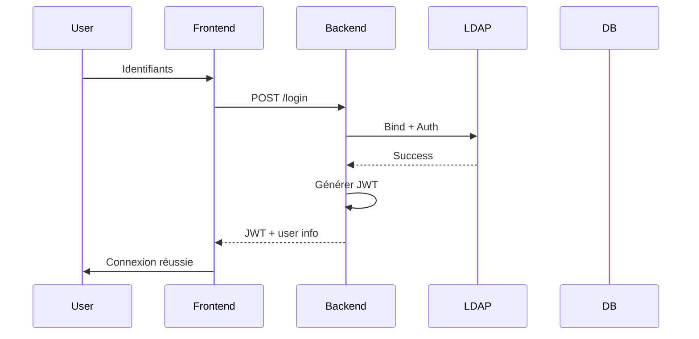

# Authentification - Flux LDAP → JWT

## Vue d'ensemble

L'application utilise un système d'authentification hybride :
- **LDAP** pour l'authentification initiale (Active Directory / OpenLDAP)
- **JWT** pour l'autorisation stateless des API et sessions

## Flux détaillé

1. **Login utilisateur**
   - Le frontend envoie les identifiants (username/password) à l'endpoint `/api/login`
   - Le backend valide les credentials contre le serveur **LDAP**

2. **Validation LDAP**
   - Connexion au LDAP avec `Bind`
   - Recherche de l'utilisateur (`userSearchFilter`)
   - Vérification du mot de passe

3. **Génération JWT**
   - Si succès → création d'un **JWT** signé contenant :
     - `sub` (username)
     - `roles` / groupes LDAP
     - `permissions` (éventuellement)
     - `exp` (expiration)
     - Autres claims métier

4. **Utilisation du token**
   - Le client stocke le JWT (localStorage / HttpOnly cookie)
   - Chaque requête API inclut `Authorization: Bearer <token>`
   - Le backend valide la signature et l'expiration du JWT (sans re-consulter LDAP à chaque fois)

## Avantages
- Découplage authentification / autorisation
- Scalabilité (stateless)
- Expiration automatique des sessions
- Possibilité de refresh token

## Schéma

