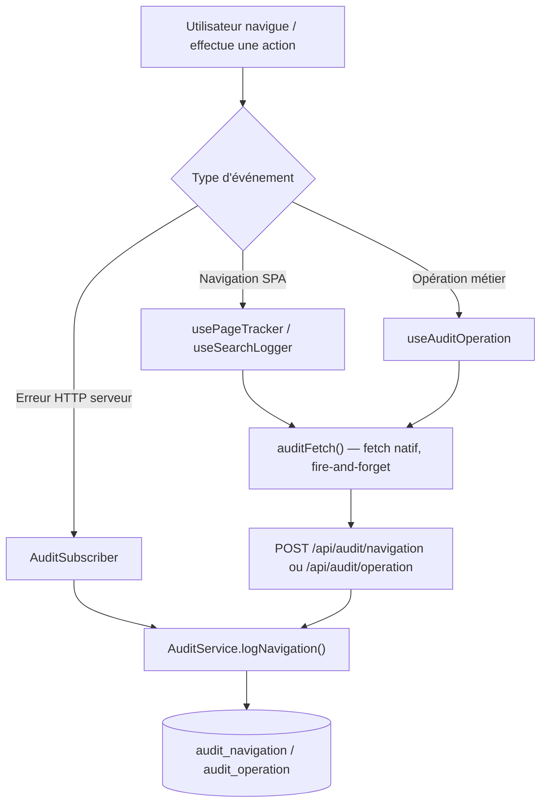
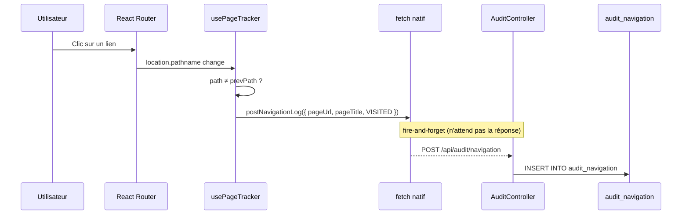
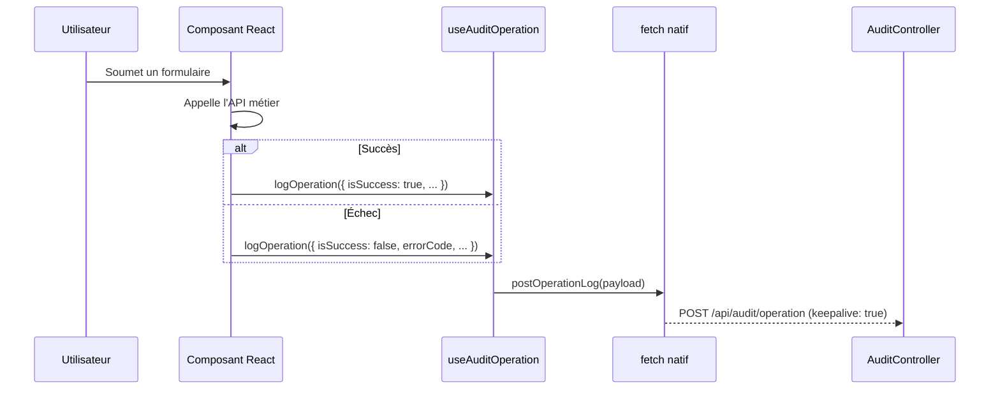
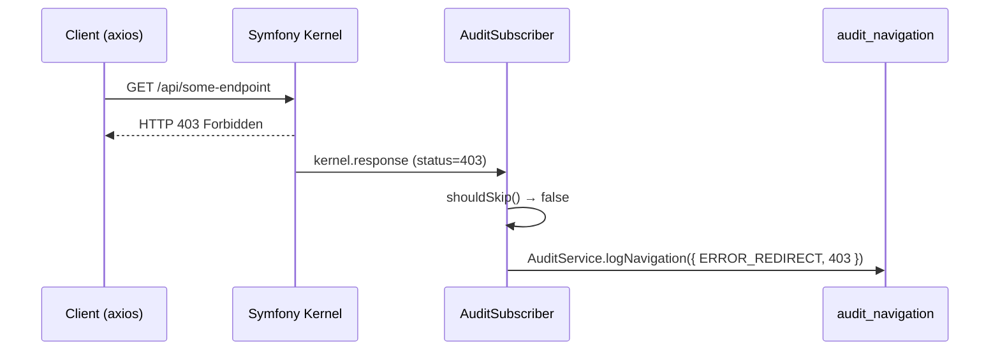

# Historisation (Audit)

## Vue d'ensemble

Le système d'historisation enregistre **deux types d'événements** distincts pour toute l'application :

| Table | Ce qu'elle trace |
|---|---|
| `audit_navigation` | Visites de pages, recherches, actions tentées/annulées, redirections vers une page d'erreur |
| `audit_operation` | Résultats d'opérations métier : soumission, validation, suppression, upload, fusion fichier… |

**Principe directeur** : l'audit ne doit jamais bloquer l'expérience utilisateur. Un log raté est silencieusement ignoré — il ne produit ni exception, ni chargement, ni notification.



---

## Architecture backend

### AuditService

**Fichier :** [backend/src/Audit/Service/AuditService.php](../../../backend/src/Audit/Service/AuditService.php)

Le service est la seule porte d'entrée pour écrire dans les tables d'audit.

**Décision technique critique — DBAL plutôt qu'ORM :**

```php
// ✅ Correct — DBAL direct
$this->conn->insert('audit_navigation', $row);

// ❌ À éviter — ORM
$this->em->persist($entity);
$this->em->flush(); // Une exception ici ferme l'EntityManager définitivement
```

Un `flush()` ORM qui échoue (table absente, contrainte violée) ferme l'EntityManager de façon permanente. Toutes les requêtes suivantes de la même session HTTP échouent alors — y compris l'authentification, les permissions, les données métier. Le DBAL `insert()` est atomique : une erreur n'a aucun effet de bord sur le reste de l'application.

Chaque méthode est entièrement enveloppée dans un `try/catch(\Throwable)` :

```php
public function logNavigation(array $data): void
{
    try {
        $user    = $this->security->getUser();
        $company = $this->securityContext->getActiveCompany();
        // ...
        $this->conn->insert('audit_navigation', array_filter($row, fn($v) => $v !== null));
    } catch (\Throwable $e) {
        error_log('[AuditService] logNavigation failed: ' . $e->getMessage());
    }
}
```

**Injection dans services.yaml :**

```yaml
App\Audit\Service\AuditService:
    bind:
        Doctrine\DBAL\Connection: '@doctrine.dbal.sqlserver_connection'
```

### AuditController

**Fichier :** [backend/src/Audit/Controller/AuditController.php](../../../backend/src/Audit/Controller/AuditController.php)  
**Préfixe :** `/api/audit`

| Méthode | Route | Description |
|---|---|---|
| `POST` | `/api/audit/navigation` | Reçoit un événement de navigation depuis le frontend — répond `204 No Content` |
| `GET`  | `/api/audit/navigation` | Liste les logs de navigation (admin) |
| `POST` | `/api/audit/operation` | Reçoit un événement d'opération métier — répond `204 No Content` |
| `GET`  | `/api/audit/operation` | Liste les logs d'opération (admin) |
| `GET`  | `/api/audit/operation/document/{documentType}/{documentId}` | Historique complet d'un document donné |

**Filtres disponibles sur `GET /api/audit/navigation` :**

| Paramètre | Type | Effet |
|---|---|---|
| `limit` | int (max 500) | Nombre de résultats |
| `companyId` | int | Filtre par société |
| `userId` | int | Filtre par utilisateur |
| `errorsOnly` | bool | Retourne uniquement les `ERROR_REDIRECT` |

**Filtres disponibles sur `GET /api/audit/operation` :**

| Paramètre | Type | Effet |
|---|---|---|
| `limit` | int (max 500) | Nombre de résultats |
| `companyId` | int | Filtre par société |
| `operationType` | string | Filtre par type d'opération |
| `documentType` | string | Filtre par type de document |
| `failuresOnly` | bool | Retourne uniquement les opérations échouées |

### AuditSubscriber

**Fichier :** [backend/src/Audit/EventSubscriber/AuditSubscriber.php](../../../backend/src/Audit/EventSubscriber/AuditSubscriber.php)

Capture automatiquement les erreurs HTTP côté serveur sans intervention du code applicatif. Abonné à deux événements Symfony :

| Événement | Comportement |
|---|---|
| `kernel.response` | Logue les réponses 400/401/403/404/405/422/429/500/502/503 |
| `kernel.exception` | Logue les exceptions non gérées (≥ 500 uniquement, pour éviter le double-log) |

Routes ignorées (pour éviter la récursion ou le bruit) :

```php
private const SKIP_PREFIXES = [
    '/api/login', '/api/me', '/api/navigation', '/api/audit',
    '/_profiler', '/_wdt',
];
```

---

## Schéma des tables SQL Server

### `audit_navigation`

```
audit_navigation
├── id              → INT IDENTITY (clé primaire)
├── user_id         → INT nullable        (identifiant utilisateur)
├── username        → VARCHAR(100)        (login LDAP)
├── company_id      → INT nullable
├── company_code    → VARCHAR(50)
├── session_id      → VARCHAR(255)        (identifiant d'onglet, généré en sessionStorage)
├── page_url        → VARCHAR(500) NOT NULL
├── page_title      → VARCHAR(255)
├── action_attempted→ VARCHAR(100)        (DELETE, SEARCH, SUBMIT, VALIDATE…)
├── action_result   → VARCHAR(50)         (VISITED | SEARCHED | ATTEMPTED | CANCELLED | ERROR_REDIRECT)
├── search_data     → TEXT                (paramètres de recherche en JSON)
├── error_code      → INT nullable
├── error_message   → TEXT
├── ip_address      → VARCHAR(45)
├── user_agent      → VARCHAR(500)
├── referer_url     → VARCHAR(500)
└── created_at      → DATETIME NOT NULL
```

Index : `idx_audit_nav_user` (user_id), `idx_audit_nav_date` (created_at), `idx_audit_nav_result` (action_result)

**Valeurs `action_result` :**

| Valeur | Description |
|---|---|
| `VISITED` | Page consultée (navigation standard) |
| `SEARCHED` | Formulaire de recherche soumis |
| `ATTEMPTED` | Action initiée (ex: clic sur "Supprimer") |
| `CANCELLED` | Action abandonnée (ex: fermeture de la modale) |
| `ERROR_REDIRECT` | Redirection vers une page d'erreur HTTP |

### `audit_operation`

```
audit_operation
├── id                  → INT IDENTITY
├── user_id             → INT nullable
├── username            → VARCHAR(100)
├── company_id          → INT nullable
├── company_code        → VARCHAR(50)
├── operation_type      → VARCHAR(50) NOT NULL   (voir types ci-dessous)
├── document_type       → VARCHAR(20)             (voir types ci-dessous)
├── document_id         → VARCHAR(100)            (identifiant technique)
├── document_number     → VARCHAR(100)            (ex: DIT-2025-0001)
├── is_success          → BIT NOT NULL
├── success_message     → TEXT
├── error_message       → TEXT
├── error_code          → VARCHAR(100)
├── submitted_data      → TEXT (JSON, données sensibles expurgées)
├── constraints_violated→ TEXT (JSON : [{field, message}])
├── file_operations     → TEXT (JSON : [{type, fileName, path, success, error}])
├── page_url            → VARCHAR(500)
├── duration_ms         → INT
├── ip_address          → VARCHAR(45)
└── created_at          → DATETIME NOT NULL
```

Index : `idx_audit_op_user`, `idx_audit_op_date`, `idx_audit_op_type`, `idx_audit_op_doctype`, `idx_audit_op_success`

**Types d'opérations (`operation_type`) :**

| Valeur | Description |
|---|---|
| `SOUMISSION` | Soumission d'un formulaire |
| `VALIDATION` | Validation métier d'un document |
| `MODIFICATION` | Modification d'un document existant |
| `SUPPRESSION` | Suppression d'un enregistrement |
| `CREATION` | Création d'un nouveau document |
| `CLOTUR` | Clôture d'un dossier ou d'une période |
| `FILE_MERGE` | Fusion de fichiers PDF/Word |
| `DB_SAV` | Sauvegarde base de données |
| `DW_COP` | Copie vers DocuWare |
| `FILE_UPLOAD` | Téléversement de fichier |
| `ANNULATION` | Annulation d'une action |

**Types de documents (`document_type`) :**

| Code | Description |
|---|---|
| `DIT` | Demande d'intervention technique |
| `OR` | Ordre de réparation |
| `FAC` | Facture |
| `RI` | Rapport d'intervention |
| `TIK` | Ticket |
| `DA` | Demande d'achat |
| `DOM` | Dommage |
| `BDM` | Bon de mise en main |
| `CAS` | Caisse |
| `CDE` | Commande |
| `DEV` | Devis |
| `BC` | Bon de commande |
| `AC` | Avenant commande |
| `CDEFRN` | Commande fournisseur |
| `SW` | Software |
| `MUT` | Mutation |

---

## Architecture frontend

### auditApi.ts

**Fichier :** [frontend/src/domains/audit/api/auditApi.ts](../../../frontend/src/domains/audit/api/auditApi.ts)

Ce fichier expose deux interfaces :

1. **Écriture** — `postNavigationLog` et `postOperationLog` : utilisent `fetch` natif, jamais `axiosInstance`
2. **Lecture (admin)** — `fetchNavigationLogs`, `fetchOperationLogs`, `fetchDocumentHistory` : utilisent `axiosInstance` comme tout autre endpoint protégé

**Pourquoi `fetch` natif et non axios ?**

L'intercepteur de réponse axios tente un refresh de token sur toute réponse 401. Si `/api/audit/navigation` retourne 401 (par exemple parce que la table n'existe pas encore), cela déclenche une boucle refresh → logout → redirection `/login`. Le `fetch` natif échappe entièrement à cet intercepteur.

```ts
function auditFetch(path: string, body: unknown): void {
  const token = localStorage.getItem("access_token");
  if (!token) return; // Pas de log si non authentifié

  fetch(`${BASE_URL}${path}`, {
    method:    "POST",
    headers:   { "Content-Type": "application/json", "Authorization": `Bearer ${token}` },
    body:      JSON.stringify(body),
    keepalive: true, // Survit à la fermeture de la page
  }).catch(() => {}); // Erreur silencieuse
}
```

Le `keepalive: true` garantit que les logs envoyés juste avant une navigation (ex: `beforeunload`) arrivent bien au serveur même si l'onglet se ferme.

### Hook usePageTracker

**Fichier :** [frontend/src/hooks/usePageTracker.ts](../../../frontend/src/hooks/usePageTracker.ts)

Placé dans `AppLayout`, ce hook écoute chaque changement de route React Router et envoie automatiquement un log `VISITED`.

```ts
// Dans AppLayout.tsx
usePageTracker({ enabled: !!user });
```

Une protection par `prevPathRef` évite le double-log causé par le double-rendu de React StrictMode :

```ts
if (path === prevPathRef.current) return;
prevPathRef.current = path;
```

**Session ID :** un identifiant unique par onglet (`sessionStorage`) est généré au premier rendu et attaché à chaque log. Permet de reconstituer le parcours complet d'une session.

**Hooks dérivés exportés :**

| Hook / Fonction | Usage |
|---|---|
| `usePageTracker()` | Navigation automatique (à placer dans le layout) |
| `useSearchLogger()` | Retourne une fonction à appeler après un `onSubmit` de recherche |
| `useCancelledActionLogger()` | Retourne une fonction à appeler quand l'utilisateur ferme une modale d'action |
| `logErrorRedirect()` | Fonction standalone pour les pages d'erreur 404/403/500 |

### Hook useAuditOperation

**Fichier :** [frontend/src/hooks/useAuditOperation.ts](../../../frontend/src/hooks/useAuditOperation.ts)

Hook à utiliser dans les composants pour logger le résultat d'une opération métier.

```ts
const { logOperation } = useAuditOperation();

// Soumission réussie d'un DIT
await submitDit(data);
logOperation({
  operationType:  "SOUMISSION",
  documentType:   "DIT",
  documentNumber: "DIT-2025-0001",
  isSuccess:      true,
  successMessage: "DIT créé avec succès",
  submittedData:  data,
  durationMs:     performance.now() - startTime,
});

// Contrainte métier non respectée
logOperation({
  operationType:       "SOUMISSION",
  documentType:        "OR",
  isSuccess:           false,
  errorCode:           "MISSING_OR_NUMBER",
  constraintsViolated: [{ field: "numeroOR", message: "Le numéro OR est obligatoire" }],
});

// Annulation par l'utilisateur
logOperation({ operationType: "ANNULATION", documentType: "OR", isSuccess: true });
```

Pour les cas hors composant React (ex: dans un intercepteur axios) :

```ts
import { logOperationStandalone } from "@/hooks/useAuditOperation";

logOperationStandalone({ operationType: "SUPPRESSION", isSuccess: false, errorMessage: "..." });
```

**Expurgation des données sensibles :** côté backend, `AuditOperation::sanitizeData()` remplace automatiquement par `"***"` les valeurs dont la clé contient `password`, `token`, `secret`, `pin`, `cvv` ou `card`.

---

## Interface d'administration

Deux pages sont dédiées à la consultation des logs dans le module Administration :

| Route | Page | Description |
|---|---|---|
| `/admin/historique/navigation` | `AuditNavigationPage` | Tableau des visites, recherches et erreurs de navigation |
| `/admin/historique/operations` | `AuditOperationPage` | Tableau des opérations métier avec statut succès/échec |

Ces pages sont accessibles depuis la section **Historisation** de la sidebar `AdminLayout`.

---

## Flux complets

### Navigation SPA



### Opération métier



### Erreur serveur (côté backend)



---

## Notes techniques

### Prévention de la boucle auth/logout

**Problème :** si `POST /api/audit/navigation` retourne 401, l'intercepteur axios déclenche un refresh de token. Si ce refresh échoue, `handleLogout()` est appelé et redirige vers `/login`. Ce cycle se produisait à chaque changement de page.

**Solution appliquée en deux couches :**

1. `auditApi.ts` utilise `fetch` natif (n'utilise jamais axios)
2. `axios.ts` intercepteur filtre quand même les appels `/audit/` pour les lectures admin :

```ts
if (originalRequest.url?.includes("/audit/")) {
    return Promise.reject(error);
}
```

### Isolation DBAL — EntityManager protégé

L'injection dans `services.yaml` cible explicitement la connexion SQL Server et non l'EntityManager :

```yaml
App\Audit\Service\AuditService:
    bind:
        Doctrine\DBAL\Connection: '@doctrine.dbal.sqlserver_connection'
```

Si cette connexion était changée en `EntityManagerInterface`, un INSERT raté lors de l'audit fermerait l'EntityManager, rendant toutes les opérations Doctrine suivantes impossibles dans la même requête HTTP.

### Création des tables SQL Server

Les tables ne sont pas créées par les migrations Doctrine (qui ciblent l'EntityManager `ips` par défaut). Elles doivent être créées manuellement ou via :

```bash
docker compose exec backend php bin/console \
  doctrine:schema:update --em=sqlserver --force
```

> La commande crée `audit_navigation` et `audit_operation` à partir des entités Doctrine si elles n'existent pas encore.
