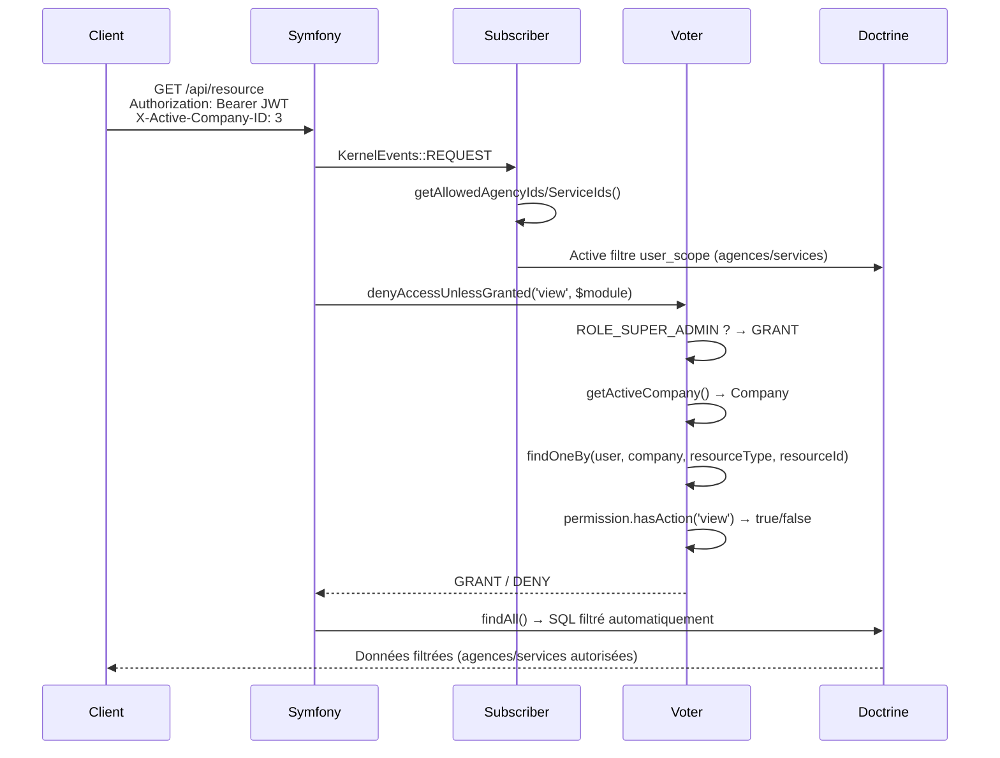

# Système de Permissions

## Vue d'ensemble

L'application utilise un système de permissions granulaire à deux niveaux :

1. **Actions sur les ressources** — ce qu'un utilisateur peut faire (voir, créer, valider…)
2. **Scope de données** — sur quelles agences/services les données sont visibles

La société active est transmise via le header HTTP `X-Active-Company-ID` à chaque requête, permettant à un même utilisateur d'avoir des droits différents selon la société choisie.

---

## Concepts clés

### AppModule et AppMenu

Les ressources protégées sont organisées en deux niveaux :

| Entité | Table BDD | Description |
|---|---|---|
| `AppModule` | `app_module` | Module applicatif (ex : Achats, Ventes) |
| `AppMenu` | `app_menu` | Sous-menu d'un module (ex : Bons de commande) |

Chaque ressource possède un `slug` unique qui peut être utilisé directement dans les vérifications de permission.

### AppAction — Actions disponibles

Les actions sont stockées en base dans la table `app_action_def` et gérables via l'interface d'administration (`/admin/actions`). La liste ci-dessous correspond aux 13 actions chargées par défaut via les fixtures :

| Catégorie | Actions |
|---|---|
| Lecture | `view`, `export`, `print` |
| Écriture | `create`, `edit`, `delete` |
| Métier | `validate`, `approve`, `duplicate`, `archive` |
| Import | `import` |
| Administration | `manage_users`, `manage_permissions` |

> Les constantes `AppAction::ALL` dans `AppAction.php` sont conservées pour la validation backend dans `AdminUserPermissionController`. L'UI lit les actions depuis l'API (`/api/admin/actions`) et non depuis ce fichier.
>
> Voir [Interface d'administration — Gestion des actions](./administration.md#gestion-des-actions-de-permission) pour ajouter ou modifier des actions.

### UserPermission — Droits par utilisateur

L'entité `UserPermission` ([backend/src/Security/Entity/UserPermission.php](../../backend/src/Security/Entity/UserPermission.php)) stocke les droits d'un utilisateur pour une ressource donnée et une société donnée :

```
app_user_permission
├── userId         → Utilisateur concerné
├── companyId      → Société concernée (multi-société)
├── resourceType   → 'module' ou 'menu'
├── resourceId     → ID du module ou menu
├── actions        → ["view", "edit", "validate"]  (JSON)
├── scopeAll       → true = accès à toutes les agences et tous leurs services
└── agencyScopes   → JSON nullable — liste de paires agence/services (voir ci-dessous)
```

#### Structure de `agencyScopes`

Quand `scopeAll = false`, la portée est définie par une liste de paires **agence → services** :

```json
[
  { "agencyId": 12, "allServices": true,  "serviceIds": []     },
  { "agencyId": 7,  "allServices": false, "serviceIds": [3, 9] }
]
```

Ce modèle remplace l'ancienne approche à quatre champs indépendants (`allAgences`, `allServices`, `agenceIds`, `serviceIds`) qui créait une ambiguïté : cocher l'agence `01` et le service `NEG` donnait accès à `01-NEG` **et** `30-NEG`. La nouvelle structure garantit que seules les paires explicitement configurées sont autorisées.

> **Migration :** les colonnes `allAgences`, `allServices`, `agenceIds`, `serviceIds` ont été supprimées et remplacées par `scopeAll` (bool, NOT NULL) et `agencyScopes` (JSON, nullable).

### PermissionTemplate — Modèles réutilisables

Les modèles permettent de pré-configurer un ensemble de permissions et de les appliquer rapidement à plusieurs utilisateurs.

**Entité :** [PermissionTemplate.php](../../backend/src/Security/Entity/PermissionTemplate.php)  
**Entité item :** [PermissionTemplateItem.php](../../backend/src/Security/Entity/PermissionTemplateItem.php)

```
app_permission_template
├── id          → Identifiant
├── name        → Nom unique
└── description → Optionnelle

app_permission_template_item
├── id           → Identifiant
├── templateId   → Référence au modèle parent (cascade remove)
├── companyId    → Société
├── resourceType → 'module' ou 'menu'
├── resourceId   → ID du module ou menu
├── actions      → JSON
├── scopeAll     → bool
└── agencyScopes → JSON nullable (même structure que UserPermission)
```

Un item de modèle est structurellement identique à une `UserPermission` sans le champ `user`. Lors de l'application (`applyTemplate`), chaque item est cloné en `UserPermission` pour l'utilisateur cible.

### UserScope — Portée des données

L'entité `UserScope` ([backend/src/Security/Entity/UserScope.php](../../backend/src/Security/Entity/UserScope.php)) définit les agences et services visibles globalement pour un utilisateur, indépendamment des permissions :

```
app_user_scope
├── userId     → Utilisateur (relation OneToOne)
├── agencies   → Liste des agences autorisées
└── services   → Liste des services autorisés
```

---

## Voters Symfony

### AppActionVoter

`AppActionVoter` ([backend/src/Security/Voter/AppActionVoter.php](../../backend/src/Security/Voter/AppActionVoter.php)) vérifie si un utilisateur peut effectuer une action sur un module ou un menu.

**Supports :** toute action de `AppAction::ALL` sur un `AppModule`, `AppMenu`, ou un slug `string`.

**Logique de décision :**

```
1. L'utilisateur n'est pas authentifié → DENY
2. L'utilisateur est ROLE_SUPER_ADMIN   → GRANT (accès total)
3. Header X-Active-Company-ID absent    → DENY
4. Recherche de UserPermission pour (user, company, resourceType, resourceId)
5. Vérifie que l'action demandée est dans permission.actions → GRANT/DENY
```

**Utilisation dans un contrôleur :**

```php
// Par objet
$this->denyAccessUnlessGranted(AppAction::EDIT, $appModule);

// Par slug (pratique si on n'a pas l'objet)
$this->denyAccessUnlessGranted(AppAction::CREATE, 'bons-de-commande');
```

### AppResourceVoter

`AppResourceVoter` ([backend/src/Security/Voter/AppResourceVoter.php](../../backend/src/Security/Voter/AppResourceVoter.php)) vérifie spécifiquement l'accès `VIEW` sur un module ou menu, typiquement pour la navigation.

**Supports :** uniquement `AppAction::VIEW` sur `AppModule` ou `AppMenu`.

---

## Filtrage automatique des données (Doctrine)

### SecurityContextService

`SecurityContextService` ([backend/src/Security/Service/SecurityContextService.php](../../backend/src/Security/Service/SecurityContextService.php)) est le service central qui expose :

- `getActiveCompany()` — lit le header `X-Active-Company-ID`
- `getUserScope()` — récupère le `UserScope` de l'utilisateur connecté
- `getAllowedAgencyIds()` — liste des IDs d'agences autorisées
- `getAllowedServiceIds()` — liste des IDs de services autorisés

### UserScopeFilter (Doctrine SQL Filter)

`UserScopeFilter` ([backend/src/Security/Doctrine/UserScopeFilter.php](../../backend/src/Security/Doctrine/UserScopeFilter.php)) est un filtre Doctrine qui s'applique automatiquement sur toutes les requêtes SQL des entités concernées.

Il filtre sur deux colonnes IPS/Informix :
- `nent_succ` — succursale/agence
- `nent_servcrt` — service créateur

### SecurityFilterSubscriber

`SecurityFilterSubscriber` ([backend/src/Security/EventSubscriber/SecurityFilterSubscriber.php](../../backend/src/Security/EventSubscriber/SecurityFilterSubscriber.php)) active le filtre Doctrine au début de chaque requête HTTP (priorité 10, après l'authentification) :

```
KernelEvents::REQUEST
  → getAllowedAgencyIds() + getAllowedServiceIds()
  → Active le filtre 'user_scope' si scope restreint
  → Injecte les IDs autorisés dans le filtre SQL
```

---

## Flux complet d'une requête protégée



---

## ROLE_SUPER_ADMIN

Un utilisateur avec le rôle `ROLE_SUPER_ADMIN` bypass tous les voters et n'a pas de filtre de scope appliqué. Ce rôle est assigné dans l'entité `User` via la méthode `getRoles()`.

---

## Ajouter une permission sur un nouveau module

1. Créer un `AppModule` (ou `AppMenu`) en base avec un `slug` unique
2. Créer une `UserPermission` pour l'utilisateur cible :
   ```php
   $permission = new UserPermission();
   $permission->setUser($user);
   $permission->setCompany($company);
   $permission->setResourceType('module');
   $permission->setResourceId($module->getId());
   $permission->setActions([AppAction::VIEW, AppAction::EDIT]);
   $permission->setScopeAll(true); // accès à toutes les agences
   // ou portée restreinte :
   $permission->setScopeAll(false);
   $permission->setAgencyScopes([
       ['agencyId' => 12, 'allServices' => true, 'serviceIds' => []],
   ]);
   ```
3. Protéger le contrôleur avec le voter :
   ```php
   $this->denyAccessUnlessGranted(AppAction::VIEW, 'mon-module-slug');
   ```

---

## Réutilisation des permissions

Deux mécanismes sont disponibles pour éviter de reconfigurer manuellement les mêmes permissions pour plusieurs utilisateurs.

### Copie depuis un autre utilisateur

```php
// Endpoint : POST /api/admin/users/{targetId}/copy-from/{sourceId}
// Body : { "mode": "replace" | "merge" }
```

- **replace** — supprime toutes les permissions de la cible, puis clone celles de la source
- **merge** — n'ajoute que les permissions absentes (clé = companyId + resourceType + resourceId)

### Application d'un modèle

```php
// Endpoint : POST /api/admin/users/{id}/apply-template/{templateId}
// Body : { "mode": "replace" | "merge" }
```

Crée des `UserPermission` à partir des `PermissionTemplateItem` du modèle, avec les mêmes modes replace/merge.

> Voir [Interface d'administration — Modèles de permissions](./administration.md#modèles-de-permissions) pour la gestion des modèles depuis l'UI.
