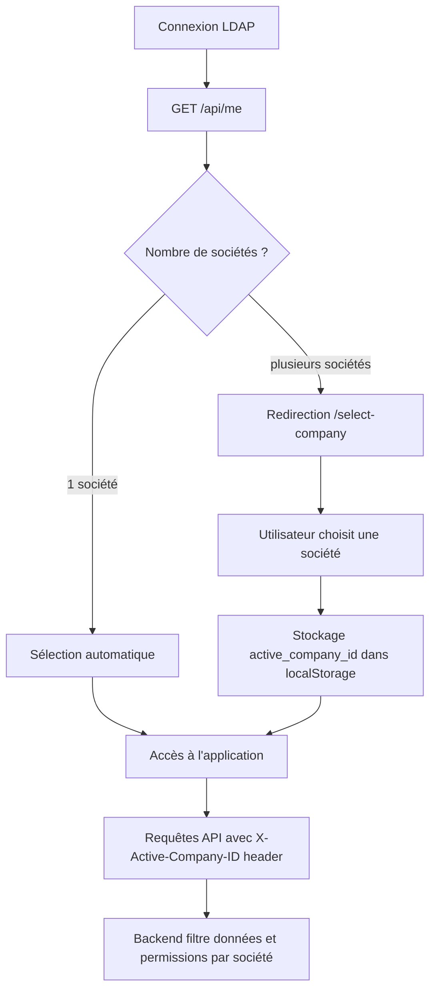

# Sélection de société (multi-société)

## Vue d'ensemble

L'application supporte les utilisateurs appartenant à **plusieurs sociétés** (ex : HFF, FRAISE…). Après la connexion, si un utilisateur a accès à plus d'une société, il est redirigé vers une page de sélection avant d'accéder à l'application.

La société active est ensuite transmise à **chaque requête API** via le header HTTP `X-Active-Company-ID`, permettant au backend de filtrer les données et les permissions en conséquence.

---

## Flux complet



---

## Backend

### Entité `Company`

[backend/src/Security/Entity/Company.php](../../../backend/src/Security/Entity/Company.php)

```
app_company
├── id      → Identifiant unique
├── name    → Nom complet (ex : "HOLDING FRAISE")
├── code    → Code court unique (ex : "HFF")
└── agencies → Agences rattachées à cette société (1:N)
```

### Endpoint `/api/me`

[backend/src/Security/Controller/SecurityController.php](../../../backend/src/Security/Controller/SecurityController.php)

La réponse inclut la liste des sociétés auxquelles l'utilisateur a accès (via ses `UserPermission`) :

```json
{
  "displayName": "Jean Dupont",
  "companies": [
    { "id": 1, "name": "HOLDING FRAISE", "code": "HFF" },
    { "id": 2, "name": "FRAISE SUD",     "code": "FS"  }
  ]
}
```

### Header `X-Active-Company-ID`

Le backend lit ce header dans `SecurityContextService.getActiveCompany()` pour déterminer la société active de chaque requête :

[backend/src/Security/Service/SecurityContextService.php](../../../backend/src/Security/Service/SecurityContextService.php)

```php
$companyId = $request->headers->get('X-Active-Company-ID');
$this->activeCompany = $entityManager->getRepository(Company::class)->find($companyId);
```

Ce header est **requis** par l'endpoint `/api/navigation` (retourne 400 si absent).

---

## Frontend

### Contexte d'authentification

[frontend/src/context/authContext.tsx](../../../frontend/src/context/authContext.tsx)

Trois ajouts au `AuthContext` :

| Valeur | Type | Description |
|---|---|---|
| `activeCompany` | `Company \| null` | Société actuellement sélectionnée |
| `selectCompany` | `(company: Company) => void` | Sélectionne une société et la persiste |
| `user.companies` | `Company[]` | Liste des sociétés accessibles à l'utilisateur |

**Logique de sélection automatique :**
- Si l'utilisateur n'a qu'**une seule société** → sélection immédiate sans redirection
- Si plusieurs sociétés → `activeCompany` reste `null` jusqu'au choix de l'utilisateur
- La société choisie est persistée dans `localStorage` (`active_company_id`) et restaurée à chaque rechargement de page

### Intercepteur Axios

[frontend/src/conf/axios.ts](../../../frontend/src/conf/axios.ts)

Le header `X-Active-Company-ID` est injecté automatiquement dans **toutes les requêtes** sortantes :

```ts
const activeCompanyId = localStorage.getItem("active_company_id");
if (activeCompanyId) {
  config.headers["X-Active-Company-ID"] = activeCompanyId;
}
```

### Page de sélection

[frontend/src/domains/authentification/pages/SelectCompany.tsx](../../../frontend/src/domains/authentification/pages/SelectCompany.tsx)

Page affichée à `/select-company` lorsque l'utilisateur a plusieurs sociétés et n'en a pas encore choisie. Chaque société est présentée sous forme de carte cliquable affichant le nom et le code.

### Guard `RequireCompany`

[frontend/src/routes/guards/RequireCompany.tsx](../../../frontend/src/routes/guards/RequireCompany.tsx)

Protège toutes les routes principales de l'application. Si l'utilisateur a plusieurs sociétés et qu'aucune n'est sélectionnée, il est redirigé vers `/select-company` :

```
/login          → AnonymousOnly (public)
/select-company → RequireAuth seulement
/              )
/magasin/...  )  → RequireAuth + RequireCompany
/atelier/...  )
/it/...        )
```

---

## Cycle de vie de la société active

| Événement | Action |
|---|---|
| Connexion — 1 société | Sélection automatique (pas de localStorage écrit) |
| Connexion — N sociétés | Redirection vers `/select-company` |
| Choix d'une société | `localStorage.active_company_id = id`, mise à jour du contexte |
| Rechargement de page | `selectedCompanyId` initialisé depuis `localStorage` au montage |
| Déconnexion | `localStorage.active_company_id` supprimé, contexte réinitialisé |
