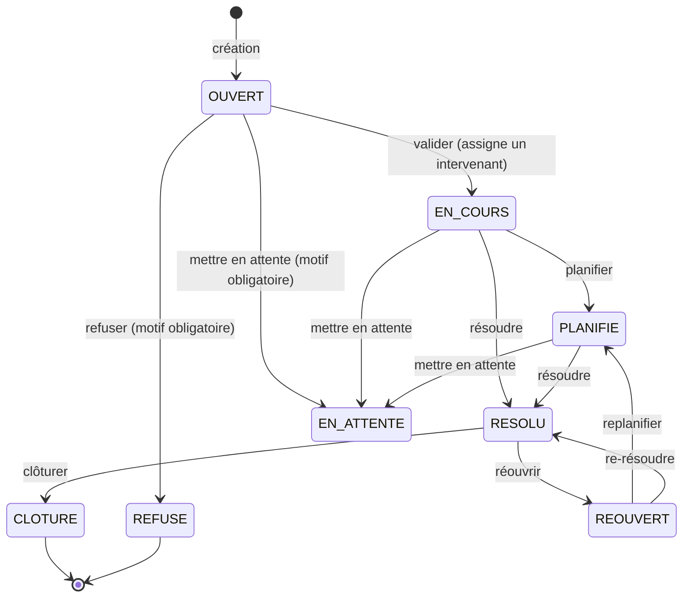

# Module TIK — Support informatique

## Vue d'ensemble

Le module TIK est le portage du système de tickets de support informatique du legacy (`C:\wamp64\www\Hffintranet`). Un utilisateur (le **demandeur**) crée une demande de support ; un **validateur** l'assigne à un **intervenant** ; l'intervenant planifie et résout ; le demandeur (ou un validateur) clôture.

Contrairement au legacy — dont le système de rôles (`ROLE_VALIDATEUR`, `ROLE_INTERVENANT`) s'est révélé non fonctionnel à l'usage (`getRoleNames()` inexistant, `hasRole()` toujours `false`) — ce portage n'introduit **aucun rôle global**. Les droits de validateur/intervenant reposent entièrement sur le [système de permissions fines](./permissions.md) déjà existant : un utilisateur peut être validateur TIK sans l'être dans un autre module.

---

## Modèle de données

```
tik_categorie
├── id
└── description                    (ex : "MATERIELS")

tik_sous_categorie
├── id
├── categorie_id  → tik_categorie
└── description

tik_autres_categorie
├── id
├── sous_categorie_id → tik_sous_categorie
└── description

tik_ticket
├── id
├── numero_ticket        → TIK + AAMM + séquence 4 chiffres (ex : TIK26070001)
├── objet_demande, detail_demande (HTML — WYSIWYG)
├── categorie_id, sous_categorie_id, autres_categorie_id  → hiérarchie 3 niveaux
├── niveau_urgence       → P1..P5 (défaut P4)
├── demandeur_id         → User (créateur du ticket)
├── agence_emetteur_id / service_emetteur_id   → dérivés du demandeur (Personnel → Centre), lecture seule
├── agence_debiteur_id / service_debiteur_id   → éditables à la création
├── parc_informatique, date_fin_souhaitee
├── statut               → voir workflow ci-dessous
├── intervenant_id       → Personnel assigné (lié à un User via matricule)
├── validateur_id        → User qui a traité la demande (valider/refuser/mettre en attente)
├── date_debut_planning / date_fin_planning
├── file_names           → JSON des pièces jointes ([{name, storedName, sizeKb}])
└── created_at

tik_historique
├── id
├── tik_id     → tik_ticket
├── statut     → statut au moment de l'entrée
├── commentaire (nullable)
├── user_id    → auteur du changement
└── created_at
```

**Entités :** [Tik.php](../../../backend/src/Tik/Entity/Tik.php), [TikCategorie.php](../../../backend/src/Tik/Entity/TikCategorie.php), [TikSousCategorie.php](../../../backend/src/Tik/Entity/TikSousCategorie.php), [TikAutresCategorie.php](../../../backend/src/Tik/Entity/TikAutresCategorie.php), [TikHistorique.php](../../../backend/src/Tik/Entity/TikHistorique.php)

> La hiérarchie catégorie → sous-catégorie → autre catégorie est une relation `ManyToOne` simple, plus stricte que le M2M du legacy qui permettait des combinaisons incohérentes.

---

## Workflow des statuts



`transferer` (changement d'intervenant) ne modifie pas le statut — disponible depuis `EN_COURS`, `PLANIFIE` et `REOUVERT`.

### Qui peut faire quoi

| Action | Rôle requis | Condition de statut |
|---|---|---|
| `valider` | Permission `validate` sur le module `tik` | `OUVERT` |
| `refuser` | Permission `validate` sur `tik` | `OUVERT` (commentaire obligatoire) |
| `mettre-en-attente` | Permission `validate` sur `tik` | Tout sauf `CLOTURE`/`REFUSE` (commentaire obligatoire) |
| `planifier` | Intervenant assigné au ticket | `EN_COURS`, `REOUVERT` |
| `transferer` | Intervenant assigné au ticket | `EN_COURS`, `PLANIFIE`, `REOUVERT` |
| `resoudre` | Intervenant assigné au ticket | `EN_COURS`, `PLANIFIE`, `REOUVERT` |
| `cloturer` | Demandeur **ou** permission `validate` | `RESOLU` |
| `reouvrir` | Demandeur uniquement | `RESOLU` (motif obligatoire) |

Ces règles sont calculées côté serveur dans `TikController::serialize()` et renvoyées au frontend sous forme de booléens (`actions.peutValider`, `actions.peutPlanifier`, …) — le frontend se contente d'afficher/masquer les boutons, il ne réévalue jamais les permissions lui-même.

---

## Permissions — module TIK

Le module est enregistré comme un `AppModule` classique (`slug: 'tik'`), au même titre que Magasin ou Atelier. Deux actions du système de permissions générique sont utilisées :

| Action | Usage |
|---|---|
| `validate` (existante) | Être validateur : valider / refuser / mettre en attente / clôturer un ticket |
| `intervene` (ajoutée pour TIK) | Être éligible comme intervenant assigné sur un ticket |

```php
// AppAction.php
public const INTERVENE = 'intervene';
```

### Pourquoi pas des rôles globaux ?

Un rôle Symfony (`ROLE_VALIDATEUR`) s'applique à **tout** un utilisateur, dans **tous** les modules. Or un même utilisateur peut être validateur des tickets TIK sans l'être, par exemple, des demandes d'intervention Atelier. Le système `UserPermission` (voir [Système de Permissions](./permissions.md)) permet déjà cette granularité par module et par société active — TIK est simplement son premier vrai consommateur pour ce genre de rôle métier "être éligible comme X".

### Résolution de l'intervenant assigné

`intervenant_id` référence un `Personnel`, pas un `User` — comme partout ailleurs dans le projet, le lien se fait via le champ `User.matricule` :

```php
private function isAssignedIntervenant(Tik $tik, User $user): bool
{
    return $tik->getIntervenant()->getMatricule() === $user->getMatricule();
}
```

### Lister les intervenants éligibles

Contrairement à un `Voter` (qui ne vérifie que l'utilisateur **courant**), `GET /api/tik/tickets/intervenants` doit lister tous les utilisateurs ayant la permission `intervene`, quel que soit l'utilisateur connecté. Le contrôleur interroge donc directement `UserPermission` :

```php
private function usersWithTikAction(string $action): array
{
    $tikModule = $this->em->getRepository(AppModule::class)->findOneBy(['slug' => 'tik']);
    $permissions = $this->em->getRepository(UserPermission::class)->findBy([
        'company' => $this->securityContext->getActiveCompany(),
        'resourceType' => 'module',
        'resourceId' => $tikModule->getId(),
    ]);

    return array_values(array_filter(array_map(
        fn(UserPermission $p) => $p->hasAction($action) ? $p->getUser() : null,
        $permissions,
    )));
}
```

Ces `User` sont ensuite reliés à leur fiche `Personnel` par matricule pour obtenir nom/prénom affichables.

### Configurer les droits d'un utilisateur

Depuis `/admin/utilisateurs/:userId/permissions`, ajouter une permission sur le module **Support Informatique** avec les actions `validate` et/ou `intervene` — aucune UI spécifique à TIK n'a été nécessaire, l'interface générique de gestion des permissions gère ce module comme n'importe quel autre.

---

## Écriture SQL Server : DBAL, pas l'ORM

Comme tous les modules mappés sur la connexion `sqlserver`, TIK **lit** via l'ORM mais **écrit** via DBAL brut (`Connection::insert()/update()`), jamais `EntityManager::persist()/flush()` :

```php
$this->conn->insert('tik_ticket', [...]);
$this->conn->update('tik_ticket', ['statut' => Tik::STATUT_EN_COURS], ['id' => $id]);
```

**Raison :** le driver SQL Server custom (`App\Doctrine\SqlServer\SqlServerDriver`) échoue à convertir les objets `\DateTime` liés en paramètre par l'UnitOfWork de l'ORM ("conversion failed"). Toutes les dates envoyées à cette connexion doivent en plus être formatées avec le séparateur `T` (`Y-m-d\TH:i:s`), pas `Y-m-d H:i:s` — ce dernier format se fait swapper jour/mois par la session SQL Server.

Après une écriture DBAL, l'identity map de l'ORM garde l'ancienne version de l'entité en cache. `serializeFresh()` appelle `$this->em->clear()` avant de recharger via `$this->tikRepo->find($id)` :

```php
private function serializeFresh(int $id, User $user): array
{
    $this->em->clear();
    return $this->serialize($this->tikRepo->find($id), $user);
}
```

---

## Pièces jointes

Les fichiers sont stockés hors de `public/` (DocumentRoot Apache, non protégé) :

```
backend/var/uploads/tik/{numeroTicket}/{storedName}
```

Ils ne sont accessibles que via la route authentifiée `GET /api/tik/tickets/{id}/fichiers/{storedName}` (`downloadFile()`, `BinaryFileResponse`) — jamais servis directement par le serveur web.

**Contraintes de validation** (`TikController::validateAndStoreFiles`) :

| Contrainte | Valeur |
|---|---|
| Taille maximale | 5 Mo |
| Types autorisés | PDF, JPEG, PNG, XLSX, DOCX, PPT, PPTX |

> `UploadedFile::getSize()` doit être appelé **avant** `move()` — le fichier temporaire n'existe plus après le déplacement, `getSize()` lèverait `SplFileInfo::getSize(): stat failed`.

---

## Endpoints

Tous sous `#[Route('/api/tik/tickets')]`, contrôleur [TikController.php](../../../backend/src/Tik/Controller/TikController.php).

| Méthode | Endpoint | Description |
|---|---|---|
| GET | `` | Liste des tickets (avec `actions` calculées pour l'utilisateur courant) |
| GET | `/intervenants` | Personnel éligible (permission `intervene`) |
| GET | `/defaults` | Agence/service émetteur, code société, date de fin souhaitée par défaut |
| GET | `/{id}` | Détail d'un ticket |
| GET | `/{id}/historique` | Historique des changements de statut |
| POST | `` | Création (multipart/form-data — pièces jointes) |
| GET | `/{id}/fichiers/{storedName}` | Téléchargement d'une pièce jointe (authentifié) |
| POST | `/{id}/valider` | `{ intervenantId, commentaire?, sousCategorieId?, autresCategorieId?, niveauUrgence? }` — le triage (sous-catégorie/autres-catégorie/niveau d'urgence) s'affine ici, pas à la création |
| POST | `/{id}/refuser` | `{ commentaire }` (obligatoire) |
| POST | `/{id}/mettre-en-attente` | `{ commentaire }` (obligatoire) |
| POST | `/{id}/planifier` | `{ date, partOfDay }` — `partOfDay` : `AM` (08:00-12:00) ou `PM` (13:30-17:30), comme le legacy ; contrairement au legacy, une seule plage est stockée sur le ticket (pas de découpage par jour ouvré ni d'entité calendrier dédiée) |
| POST | `/{id}/transferer` | `{ intervenantId }` |
| POST | `/{id}/resoudre` | `{ commentaire? }` |
| POST | `/{id}/cloturer` | `{ commentaire? }` |
| POST | `/{id}/reouvrir` | `{ commentaire? }` |
| GET | `/{id}/commentaires` | Fil de discussion — réservé au demandeur, au validateur et à l'intervenant assigné |
| POST | `/{id}/commentaires` | `{ commentaire, fichiers[]? }` (multipart) — message libre, indépendant du statut |

Catégories : [TikCategorieController.php](../../../backend/src/Tik/Controller/TikCategorieController.php) — `GET /api/tik/categories` (arbre à 3 niveaux) + CRUD admin.

> Seule la création (`POST ''`) et le fil de discussion (`POST '/{id}/commentaires'`) lisent `$request->request->all()`/`$request->request->get()` (form-params, pour la compatibilité multipart). Tous les autres endpoints POST lisent `json_decode($request->getContent())`.

### Fil de discussion (lot 3)

Portage du legacy `TkiCommentaires` : un message libre par ticket, indépendant des changements de statut (contrairement aux commentaires attachés à `valider`/`refuser`/etc., qui vont dans `tik_historique`). Table `tik_commentaire` ([create_tik_commentaire_table.sql](../../../backend/sql/create_tik_commentaire_table.sql)), entité [TikCommentaire.php](../../../backend/src/Tik/Entity/TikCommentaire.php).

Accès (lecture et écriture) réservé aux trois parties **concrètement impliquées dans ce ticket précis** — `isAuthorizedToComment()` vérifie `demandeur`, `validateur` et `intervenant` de l'entité, pas la permission `validate` globale (contrairement à `isValidateur()`, qui elle ne regarde pas si ce validateur a traité CE ticket) :

```php
private function isAuthorizedToComment(Tik $tik, User $user): bool
{
    return $this->isDemandeur($tik, $user)
        || $tik->getValidateur()?->getId() === $user->getId()
        || $this->isAssignedIntervenant($tik, $user);
}
```

Les pièces jointes réutilisent `validateAndStoreFiles()` (même dossier `var/uploads/tik/{numeroTicket}/`, mêmes contraintes 5 Mo/PDF-image-Office) et la même route de téléchargement `GET /{id}/fichiers/{storedName}` que les pièces jointes du ticket — `downloadFile()` cherche d'abord parmi les pièces jointes du ticket (non protégées, comportement historique inchangé), puis parmi celles des commentaires (protégées par `isAuthorizedToComment()`, car le fil est privé).

Frontend : [TikDiscussion.tsx](../../../frontend/src/domains/it/components/TikDiscussion.tsx), affiché sur `TikDetailPage` sous l'historique, avec un composeur (texte + pièces jointes) visible seulement si `ticket.actions.peutCommenter`.

---

## Frontend

| Fichier | Rôle |
|---|---|
| [tikApi.ts](../../../frontend/src/domains/it/api/tikApi.ts) | Client API — types + fonctions `fetch*`/`create*`/actions |
| [TikCreationForm.tsx](../../../frontend/src/domains/it/components/TikCreationForm.tsx) | Formulaire de création (calqué sur le legacy) |
| [TikActionDialog.tsx](../../../frontend/src/domains/it/components/TikActionDialog.tsx) | Dialogue unique gérant les 8 actions du workflow |
| [TikListPage.tsx](../../../frontend/src/domains/it/page/TikListPage.tsx) | Liste des tickets |
| [TikDetailPage.tsx](../../../frontend/src/domains/it/page/TikDetailPage.tsx) | Détail + actions + historique |
| [WysiwygEditor.tsx](../../../frontend/src/components/common/WysiwygEditor.tsx) | Éditeur Tiptap réutilisable (objet/détail de la demande) |

Routes : `/it/demande-support-informatique`, `/it/tickets`, `/it/tickets/:id`.

Le détail de la demande (`detailDemande`) est saisi via un éditeur WYSIWYG (Tiptap) et stocké en HTML — pas de sanitization côté backend au-delà de l'échappement JSON standard, à garder en tête si le contenu est un jour affiché hors du contexte applicatif de confiance actuel.

`TikActionDialog` centralise les 8 actions dans une seule modale pilotée par un objet de configuration (`ACTION_CONFIG`) qui décrit, par action, si un intervenant/des dates/un commentaire sont requis — évite de dupliquer 8 dialogues quasi identiques.
