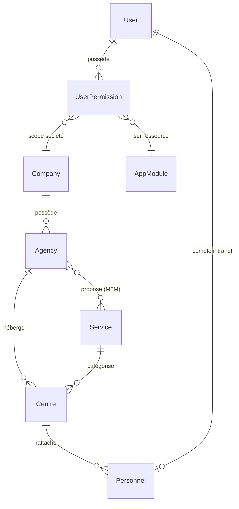
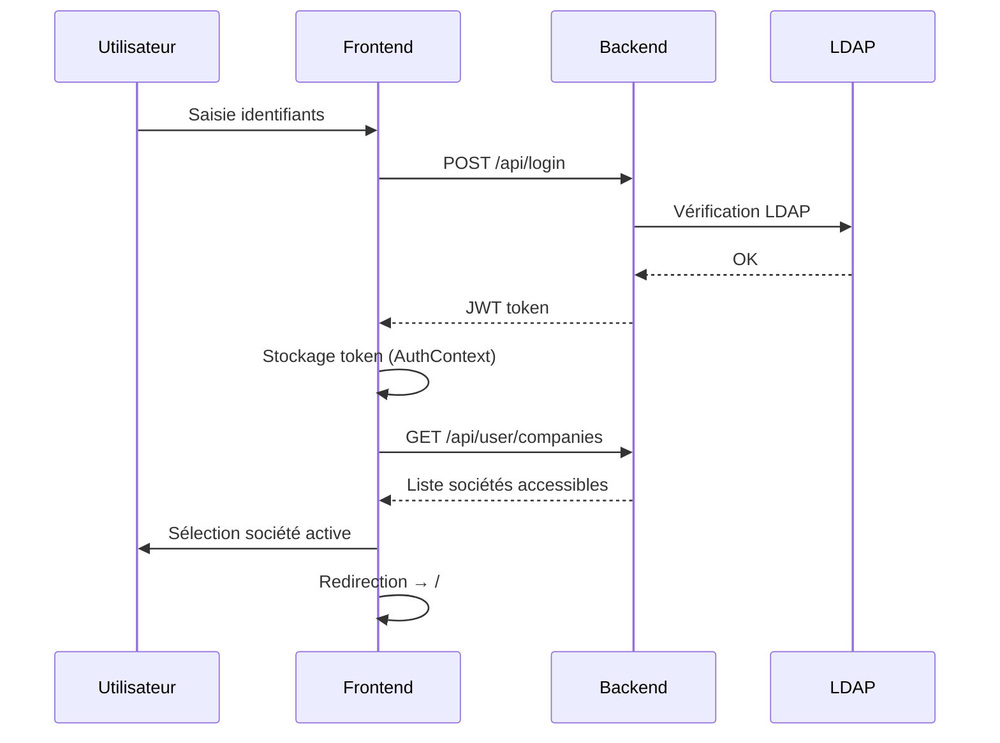

# Documentation HFF Intranet

Bienvenue dans la documentation technique de l'intranet **HFF** (Harbour Freight & Forwarding).

---

## Rapport d'architecture complet

> Ce rapport donne une vue exhaustive de la plateforme : structure, technologies, bases de données, domaines métier et patterns architecturaux.

### 1. Vue d'ensemble

L'intranet HFF est une **plateforme de gestion logistique multi-entités** conçue pour gérer les opérations de négoce, d'atelier, de location et d'énergie du groupe HFF. Elle repose sur trois grands piliers :

- **Contrôle d'accès multi-tenant** — chaque utilisateur est scopé à une ou plusieurs sociétés/agences
- **Intégration de systèmes legacy** — connexion aux bases Informix IPS et Irium existantes
- **Conformité audit** — traçabilité complète des opérations et navigations

```
┌─────────────────────────────────────────────────────────┐
│                     HFF Intranet                        │
│  ┌──────────────┐  ┌─────────────────┐  ┌───────────┐  │
│  │  React SPA   │  │  Symfony API    │  │  Docs     │  │
│  │  :5173       │  │  :8080          │  │  :3000    │  │
│  └──────┬───────┘  └───────┬─────────┘  └───────────┘  │
│         │  /api proxy      │                            │
│         └──────────────────┤                            │
│                            ├── SQL Server (sécurité)    │
│                            ├── Informix IPS  (devis)    │
│                            └── Informix Irium (devis)   │
└─────────────────────────────────────────────────────────┘
```

---

### 2. Stack technique

| Couche | Technologie | Version |
|---|---|---|
| Backend framework | Symfony | 7.4 |
| Langage backend | PHP | 8.2 |
| ORM / DBAL | Doctrine | 3.6 |
| Authentification | JWT (LexikJWTAuthenticationBundle) + LDAP | — |
| Base de données principale | SQL Server | 2019+ |
| Bases legacy | Informix IPS + Irium | — |
| Frontend framework | React | 19 |
| Langage frontend | TypeScript | 6 |
| Build tool | Vite | — |
| Styles | Tailwind CSS 4 + shadcn/ui | — |
| État serveur | TanStack Query | v5 |
| Routing frontend | React Router | v7 |
| HTTP client | Axios | — |
| Validation | Zod | — |
| Documentation | Docusaurus | 3 |

---

### 3. Structure du monorepo

```
apache/
├── backend/          → Application Symfony 7
├── frontend/         → SPA React 19 + TypeScript
├── docs-hff/         → Site Docusaurus 3
├── docker-compose.yml
└── .env              → Variables d'environnement Informix
```

#### Services Docker

| Service | Image | Port exposé | Rôle |
|---|---|---|---|
| `hff_backend` | php:8.3-apache | **8080** | API REST Symfony |
| `hff_frontend` | Node.js dev | **5173** | SPA React (Vite HMR) |
| `hff_docs` | Node.js dev | **3000** | Docusaurus dev server |

---

### 4. Architecture backend

#### Namespaces / domaines PHP

```
backend/src/
├── Security/         → Auth, utilisateurs, permissions, CRUD admin
│   ├── Entity/       → 15+ entités SQL Server
│   ├── Controller/
│   │   ├── Admin/    → 11 contrôleurs CRUD admin
│   │   └── ...       → Login, navigation, contexte
│   ├── Repository/
│   ├── Service/      → SecurityContextService
│   ├── Voter/        → Autorisation fine (voters)
│   ├── EventSubscriber/
│   └── LdapAuthenticator
│
├── Audit/            → Traçabilité opérations et navigation
│   ├── Entity/       → AuditOperation, AuditNavigation
│   ├── Controller/   → AuditController
│   └── Service/      → AuditService
│
├── Magasin/Devis/    → Gestion des devis (Informix)
│   ├── Entity/Ips/   → NegEnt, NegLig, AgrUsr
│   └── Entity/Irium/ → DevisSoumissionValidation, PointageRelance
│
├── Doctrine/
│   ├── Informix/     → Driver PDO Informix personnalisé
│   └── SqlServer/    → Driver PDO SQL Server (UTF-8)
│
└── Shared/           → AbstractInformixRepository
```

#### Gestionnaires d'entités (Entity Managers)

| EM | Base | Usage |
|---|---|---|
| `sqlserver` *(défaut)* | SQL Server 192.168.0.28 | Sécurité, permissions, audit, RH |
| `ips` | Informix IPS | Devis IPS (NegEnt, NegLig) |
| `irium` | Informix Irium | Devis Irium, pointage |

#### Endpoints API principaux

| Méthode | Route | Description |
|---|---|---|
| POST | `/api/login` | Authentification LDAP → JWT |
| GET | `/api/navigation` | Arbre de menus selon permissions |
| GET/POST/PUT/DELETE | `/api/admin/*` | CRUD admin (sociétés, agences, services, centres, personnel, permissions…) |
| GET | `/api/audit/*` | Historique opérations et navigations |
| GET | `/api/devis/*` | Consultation devis depuis Informix |
| GET | `/api/doc` | Swagger / OpenAPI |

---

### 5. Schéma de base de données (SQL Server)

#### Entités de structure

```
app_company          → Sociétés (HFF, TA…)
app_agency           → Agences (01 Antananarivo, 40 Tamatave…)
app_service          → Services (NEG, ATE, INF…)
app_centre           → Centres analytiques (01-NEG → AB11)
app_personnel        → Personnel RH (matricule, codeBancaire, → centre, → user)
```

#### Sécurité et accès

```
app_user             → Compte utilisateur (LDAP, JWT, rôles JSON)
app_user_permission  → Permission granulaire (user → ressource → actions → scope)
app_user_scope       → Scope actif (société + agence)
app_action_def       → Catalogue des actions (view, create, validate…)
app_permission_template      → Modèle de permissions réutilisable
app_permission_template_item → Items du modèle
```

#### Navigation et modules

```
app_app_module       → Modules applicatifs (Magasin, Atelier…)
app_app_menu         → Sous-menus des modules
```

#### Audit

```
audit_operation      → Opérations tracées (13 types, 15 types de document)
audit_navigation     → Événements de navigation (page, durée, user)
```

#### Relations clés



---

### 6. Architecture frontend

#### Structure `src/`

```
src/
├── main.tsx          → Entrée : PersistQueryClientProvider, Sonner, StrictMode
├── App.tsx           → ConfirmationDialog, AuthProvider, AppRoutes
├── routes/
│   ├── AppRoutes.tsx → 4 types de routes (public, auth-seul, auth+société, admin)
│   └── guards/       → RequireAuth, RequireCompany
├── auth/             → AuthContext, AnonymousOnly guard
├── conf/             → axiosInstance (intercepteurs JWT)
├── components/
│   ├── ui/           → shadcn/ui (Button, Input, Dialog, Table…)
│   └── common/       → Atomes réutilisables, filtres, pagination, Excel
└── domains/          → Modules métier (voir ci-dessous)
```

#### Domaines métier

| Domaine | Statut | Pages / Fonctionnalités |
|---|---|---|
| `authentification` | ✅ Actif | Login LDAP, sélection de société |
| `admin` | ✅ Actif | 11 pages CRUD + historique audit |
| `magasin/dematerialisation` | ✅ Actif | Liste devis IPS/Irium, planning commandes |
| `atelier/dit` | ✅ Actif | DIT : liste, création, duplication, détails |
| `it` | ✅ Actif | Demande support informatique |
| `home` | ✅ Actif | Dashboard d'accueil |
| `audit` | 🔄 En cours | Couche API uniquement |
| `client` | 🔲 Squelette | API + schéma Zod |
| `commande` | 🔲 Squelette | Données mock présentes |
| `materiel` | 🔲 Squelette | API + schéma |
| `reparation` | 🔲 Squelette | Couche API |
| `agence` / `service` / `categorie` / `niveauUrgence` | 🔲 Squelette | API uniquement |

#### Gestion de l'état

```
TanStack Query v5
├── PersistQueryClientProvider  → Pause les requêtes jusqu'à restauration IndexedDB
├── staleTime: 10 min           → Données fraîches sans refetch inutile
├── gcTime: 7 jours             → Cache persisté en IndexedDB
└── refetchOnWindowFocus: false → Pas de rechargement intempestif
```

#### Flux d'authentification



---

### 7. Système de permissions

Le système combine **voters Symfony** (backend) et **TanStack Query** (frontend) pour un contrôle d'accès granulaire.

```
UserPermission
├── company      → Société concernée
├── resourceType → "module" ou "menu"
├── resourceId   → ID du module/menu
├── actions      → ["view", "create", "validate"…]
├── scopeAll     → true = toutes agences
└── agencyScopes → [{agencyId, allServices, serviceIds}]
```

**Filtre Doctrine automatique** : `UserScopeFilter` injecte un `WHERE company_id = ?` sur toutes les requêtes selon la société active, sans modification des repositories.

---

### 8. Système d'audit

Deux tables tracent automatiquement toutes les actions :

| Table | Contenu | Déclencheur |
|---|---|---|
| `audit_operation` | Qui a fait quoi sur quel document (13 types d'opération) | `AuditService` appelé depuis les contrôleurs |
| `audit_navigation` | Quelle page a été visitée et combien de temps | `usePageTracker` (hook React) |

---

### 9. Fixtures de données

| Groupe | Classe | Table cible | Idempotent |
|---|---|---|---|
| `companies` | `CompanyFixtures` | `app_company` | Non |
| `agencies` | `AgencyFixtures` | `app_agency` | Non |
| `services` | `ServiceFixtures` | `app_service` | Non |
| `centres` | `CentreFixtures` | `app_centre` | ✅ Oui |
| `personnel` | `PersonnelFixtures` | `app_personnel` | ✅ Oui |
| `actions` | `AppActionDefFixtures` | `app_action_def` | Non |
| `lanto` | `UserLantoFixtures` | `app_user` + scopes | Non |

```bash
# Chargement sélectif (sans écraser les données existantes)
docker compose exec backend php bin/console \
  doctrine:fixtures:load --em=sqlserver --group=centres --append --no-interaction
```

---

### 10. Patterns architecturaux clés

#### Backend

| Pattern | Implémentation |
|---|---|
| **Multi-database** | 3 entity managers (SQL Server + 2 Informix) via Doctrine |
| **Filter automatique** | `UserScopeFilter` — scope société injecté dans toutes les requêtes |
| **Voter Symfony** | Autorisation granulaire sur les actions (`view`, `create`, `validate`…) |
| **Event Subscriber** | Audit automatique sur les événements d'entité |
| **Driver custom** | `SqlServerDriver` : force l'encodage UTF-8 (contournement `pdo_sqlsrv`) |
| **Fixture idempotente** | Vérification d'existence avant insertion (évite cascade `CompanyFixtures`) |

#### Frontend

| Pattern | Implémentation |
|---|---|
| **Domain-driven** | Code groupé par domaine métier, pas par type de fichier |
| **Route guards** | `RequireAuth` + `RequireCompany` combinables |
| **Server state** | TanStack Query avec persistance IndexedDB (7 jours) |
| **Latest ref** | `useRef(logout)` dans `VisualTimer` — évite les stale closures |
| **Single interval** | Timer de session : 1 `setInterval` stable vs 900 créations/session |
| **Api centralisée** | Tout dans `adminApi.ts` — types + fonctions — une seule source de vérité |

---

## Sections de la documentation

- **[Guide Docker](./guide-docker)** — Démarrer l'environnement de développement
- **[Authentification](./architecture/authentification)** — JWT, LDAP, sélection de société, guards React
- **[Permissions](./architecture/permissions)** — Voters, scopes agence/service, filtre Doctrine
- **[Administration](./architecture/administration)** — CRUD admin, permissions utilisateurs, centres, personnel, modèles
- **[Historisation](./architecture/historisation)** — Audit opérations et navigation
- **[Tests](./tests/)** — Tests backend (PHPUnit) et frontend (Vitest + MSW)
